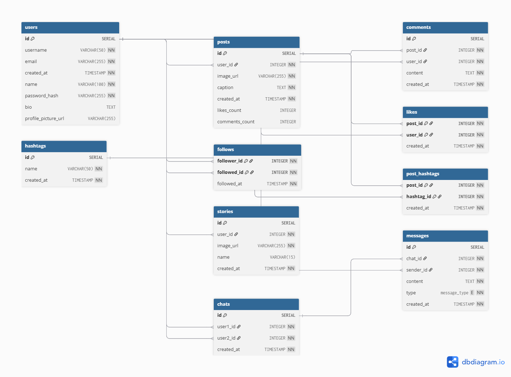

# Design Document

Mahmoud Wael Elsherbiny

Video overview: [<https://youtu.be/qgH9nyFXn7k>]()

## Scope

- This database is created for an instagram like social media application.
- The Database stores users data, posts, following relationships, and chats between users.
- The database doesn't store reports, deleted users data, saved posts.

## Functional Requirements

- The database allows users to share photos, follow other users, like and comment on posts, and send messages.
- The database doesn't allow users to report profiles, block other users, save posts.

## Representation

### Entities

## users

- `id`: Unique identifier for the user
- `username`: Unique username for the user
- `email`: Unique email address for the user
- `created_at`: Timestamp of when the user was created
- `name`: Full name of the user
- `password`: Hashed password for the user
- `bio`: Short biography of the user
- `profile_picture`: URL to the user's profile picture
  PRIMARY KEY (id)

## follows

- `follower_id`: Foreign key referencing the user who follows
- `followed_id`: Foreign key referencing the user being followed
- `followed_at`: Timestamp of when the follow relationship was created
  PRIMARY KEY (follower_id, followed_id)
  FOREIGN KEY (follower_id) REFERENCES users(id)
  FOREIGN KEY (followed_id) REFERENCES users(id)

## posts

- `id`: Unique identifier for the post
- `user_id`: Foreign key referencing the user who created the post
- `image_url`: URL to the post image
- `caption`: Caption for the post
- `created_at`: Timestamp of when the post was created
- `likes_count`: Number of likes on the post
- `comments_count`: Number of comments on the post
  PRIMARY KEY (id)
  FOREIGN KEY (user_id) REFERENCES users(id)

## comments

- `id`: Unique identifier for the comment
- `post_id`: Foreign key referencing the post the comment belongs to
- `user_id`: Foreign key referencing the user who made the comment
- `content`: Content of the comment
- `created_at`: Timestamp of when the comment was created
  PRIMARY KEY (id)
  FOREIGN KEY (post_id) REFERENCES posts(id)
  FOREIGN KEY (user_id) REFERENCES users(id)

## likes

- `post_id`: Foreign key referencing the post that was liked
- `user_id`: Foreign key referencing the user who liked the post
- `created_at`: Timestamp of when the like was made
  PRIMARY KEY (post_id, user_id)
  FOREIGN KEY (post_id) REFERENCES posts(id)
  FOREIGN KEY (user_id) REFERENCES users(id)

## hashtags

- `id`: Unique identifier for the hashtag
- `name`: Name of the hashtag
- `created_at`: Timestamp of when the hashtag was created
  PRIMARY KEY (id)

## post_hashtags

- `post_id`: Foreign key referencing the post that has the hashtag
- `hashtag_id`: Foreign key referencing the hashtag
- `created_at`: Timestamp of when the hashtag was added to the post
  PRIMARY KEY (post_id, hashtag_id)
  FOREIGN KEY (post_id) REFERENCES posts(id)
  FOREIGN KEY (hashtag_id) REFERENCES hashtags(id)

## stories

- `id`: Unique identifier for the story
- `user_id`: Foreign key referencing the user who created the story
- `image_url`: URL to the story image
- `name`: Optional text for the story
- `created_at`: Timestamp of when the story was created
  PRIMARY KEY (id)
  FOREIGN KEY (user_id) REFERENCES users(id)

## chats

- `id`: Unique identifier for the chat
- `user1_id`: Foreign key referencing the first user in the chat
- `user2_id`: Foreign key referencing the second user in the chat
- `created_at`: Timestamp of when the chat was created
  PRIMARY KEY (id)
  FOREIGN KEY (user1_id) REFERENCES users(id)
  FOREIGN KEY (user2_id) REFERENCES users(id)

## messages

- `id`: Unique identifier for the message
- `chat_id`: Foreign key referencing the chat the message belongs to
- `sender_id`: Foreign key referencing the user who sent the message
- `content`: Content of the message
- `content_type`: Type of content (text, image)
- `created_at`: Timestamp of when the message was sent
  PRIMARY KEY (id)
  FOREIGN KEY (chat_id) REFERENCES chats(id)
  FOREIGN KEY (sender_id) REFERENCES users(id)

The types are chosen based on what fits the type of data best, with size of the data being stored in consideration.
For example the value of VARCHAR max char count was selected based on the type of data.
Constraints are mostly around not allowing NULL values for data that's required. Other constraints were
for enforcing a specific value range (likes & comments being required to be >= 0)

### Relationships

- One to many
  - User => Posts: one user can create many posts
  - User => Comments: one user can create many comments
  - User => Likes: One user can create many likes
  - User => Stories: One user can create many stories
  - User => Chats: One user can participate in many chats
  - Chats => messages: One chat can contain many messages
- Many to many
  - Users => Users: users can follow each other
  - Posts => Hashtags: a post can have many hashtags, and a hashtag may belong to many posts

## Optimizations

- idx_follows_follower_id: for searching for followed users based on followers id
- idx_posts_created_at: to filter posts that were recently created
- idx_posts_user_id: to fetch posts based on user id
- idx_chat_user1_id & idx_chat_user2_id: to fetch chats for a specific user
- idx_messages_chat_id: to fetch messages for a specific chat
- idx_likes_details & idx_comments_details: to delete from the comments and likes table based on user details

## Limitations

- May not be fully optimized for query performance
- Doesn't represent the relationship between users and the types of posts they might be interested in
